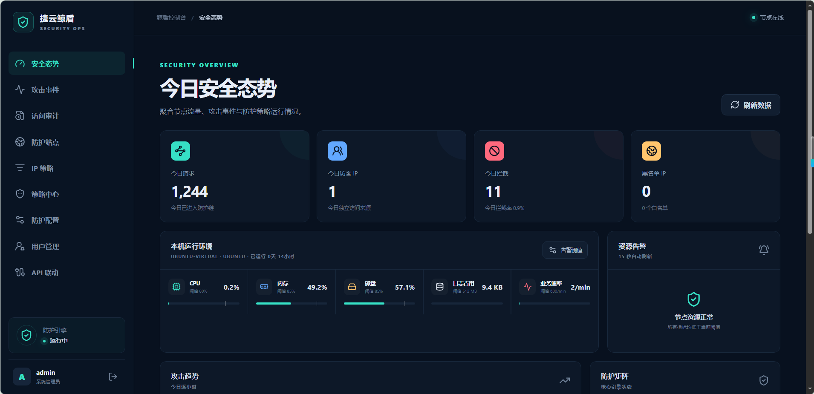

<p align="center">
  
</p>

<h1 align="center">JingShield</h1>

<p align="center">
  <strong>Lightweight Reverse-Proxy Web Application Firewall</strong><br>
  <em>Single Go Binary · Vue 3 Console · MySQL Persistence · One-Click Deploy</em>
</p>

<p align="center">
  <strong>English</strong> · <a href="README_CN.md">简体中文</a>
</p>

---

## Security Dashboard Preview

<p align="center"></p>

> Dark-themed security operations console: today's posture overview, 24-hour attack trend chart, top attack IPs, node resource monitoring (CPU / Memory / Disk / Log / Request Rate), and five-level attack classification.

---

## Overview

JingShield is a lightweight reverse-proxy **Web Application Firewall** written in Go. It combines traffic forwarding, application-layer attack detection, rate-based protection, browser verification, multi-site routing, security operations APIs, and an embedded Vue 3 management console in a single deployable binary.

The standard Linux release is a self-contained application package. Operators do not compile source code on the target server: extract the archive and use `run.sh` for installation/startup or `upgrade.sh` for an atomic upgrade with automatic rollback.

---

## Highlights

| Capability | Description |
|------------|-------------|
| **Reverse Proxy** | Go `httputil.ReverseProxy` with body-size limits and upstream timeout controls |
| **Trusted IP Resolution** | Proxy-aware client IP extraction that rejects spoofed forwarding headers |
| **Attack Detection** | SQL injection (26 regex patterns), XSS (10 patterns), custom RE2 policies, and importable Ed25519-signed rule packages |
| **CC Protection** | 7 sub-detectors: main frequency, TCP connections, mutation, shield-bypass, URL frequency, request interval, port scanning |
| **Browser Challenge** | Proof-of-work (SHA-256) challenge with HMAC-signed verification cookies and single-use tokens |
| **Multi-Site Routing** | Exact and `*.example.com` wildcard host-based dynamic upstream routing |
| **Dual Listener** | HTTP and HTTPS listeners, per-site upstream TLS verification policy, and 30-year test certificate generation |
| **IP Management** | IP / CIDR / wildcard allowlists, blocklists, and automatic temporary blocking |
| **Authentication** | Session + CSRF, management IP allowlist, bcrypt password hashing, forced initial password change |
| **Device Integration** | API Key authentication with CEF, LEEF, Suricata EVE, Wazuh, and generic JSON event normalization |
| **Monitoring** | Attack trend charts, node CPU / memory / disk / log / request rate monitoring with configurable alert thresholds |
| **Event Operations** | Five-level severity (Critical / High / Medium / Low / Info), server-side filtering, pagination, and streaming CSV export |
| **Persistence & Deploy** | MySQL persistence, idempotent schema migration, systemd hardening, and automatic upgrade rollback |

---

## Architecture

```text
Browser / API Client
        |
        v
  HTTP :18080 / HTTPS :18443
        |
        +---- /admin/        Vue 3 Management Console (embed.FS)
        +---- /api/v1/       Session + CSRF Management API
        +---- /openapi/v1/   X-API-Key Device Integration API
        +---- all other      WAF Protection Chain
                               |
                               +-- 1. System master switch
                               +-- 2. Blacklist -> 403 Block
                               +-- 3. Whitelist -> Allow (short-circuit)
                               +-- 4. Overseas IP -> 403 Block
                               +-- 5. Custom policies -> Block / Log
                               +-- 6. CC attack -> Verification page / 403
                               +-- 7. XSS detection -> 403 Block
                               +-- 8. SQL injection -> 403 Block
                               +-- 9. All passed -> Forward to site upstream by Host
```

The protection engine returns a `Decision` (Allow / Block / Verify), fully decoupled from HTTP. The proxy layer translates decisions into HTTP responses.

---

## Tech Stack

| Layer | Technology |
|-------|------------|
| Backend | Go 1.25 · stdlib `net/http` + `httputil.ReverseProxy` |
| Frontend | Vue 3.5 · TypeScript 5.9 · Vite 8 · Pinia 4 · ECharts 6 |
| Database | MySQL 5.7+ / 8.x (`go-sql-driver/mysql`) |
| Configuration | YAML + environment variable overrides + database dynamic config (30s hot-reload) |
| Monitoring | `gopsutil/v3` (CPU / memory / disk collection) |
| Security | `golang.org/x/crypto` (bcrypt) · `crypto/ed25519` (policy package signing) |
| Deployment | Linux systemd · PowerShell build scripts · Python remote deployer |

Only **5 direct Go dependencies** — no ORM, no web framework.

---

## Project Structure

```text
jingshield/
├── cmd/jingshield/main.go          # Entry point: serve / migrate / init / cert
├── internal/
│   ├── config/                     # Static config + dynamic config hot-reload
│   ├── proxy/proxy.go              # Reverse proxy + blocked page + verification page
│   ├── protection/
│   │   ├── engine.go               # 9-stage protection chain orchestration
│   │   ├── reqctx/                 # Request context + upload file inspection
│   │   ├── cc/                     # CC 7 sub-detectors + dynamic threshold
│   │   ├── detector/               # XSS / SQL injection detectors
│   │   ├── iplist/                 # IP blocklist/allowlist + overseas IP
│   │   └── verify/                 # 8 verification modes + PoW challenge
│   ├── policy/                     # RE2 policy CRUD + signed rule pack import + remote auto-update
│   ├── api/                        # 50+ REST endpoints (management + device integration)
│   ├── repository/                 # MySQL persistence + idempotent migration (13 tables)
│   ├── model/                      # Entity models + attack type / severity constants
│   ├── iplib/                      # QQWry IP geolocation (optional)
│   ├── store/memory/               # In-process memory state (Redis interface reserved)
│   └── pkg/                        # Utilities: iputil / logx / errx
├── web/                            # Vue 3 frontend (embedded into binary via embed.FS)
├── configs/config.yaml             # Static configuration
├── rules/packs/                    # Rule pack JSON files
├── scripts/                        # Build, deploy, and test scripts
├── run.sh                          # Linux one-click installation
├── upgrade.sh                      # Linux atomic upgrade + rollback
└── go.mod
```

---

## Quick Start

### Linux Complete Package Installation

Target environment requires 64-bit systemd Linux, MySQL 5.7+/8.x, `mysql` CLI client, and sudo access.

```bash
tar -xzf jingshield-0.1.0-linux-amd64.tar.gz
cd jingshield-0.1.0-linux-amd64
sudo ./run.sh
```

`run.sh` verifies all packaged files, prompts for an administrator username, creates a least-privilege system account, generates random database and session secrets, migrates the database, initializes the first administrator, generates a test certificate if needed, and starts the systemd service.

### Local Development

```powershell
cd web && npm install && npm run build && cd ..
go test ./...
go vet ./...
go run ./cmd/jingshield -c configs/config.yaml
```

Frontend development mode with live proxy:

```powershell
cd web
$env:JINGSHIELD_DEV_API='http://127.0.0.1:18080'
npm run dev
```

### Build Release Package

```powershell
pwsh -File scripts/build-linux-package.ps1 -Arch amd64
```

---

## Installed Paths

| Purpose | Path |
|---------|------|
| Application binary | `/opt/jingshield/jingshield` |
| Lifecycle scripts | `/opt/jingshield/run.sh`, `/opt/jingshield/upgrade.sh` |
| Configuration | `/opt/jingshield/config.yaml` |
| Protected secrets | `/opt/jingshield/jingshield.env` |
| Test TLS material | `/opt/jingshield/tls/` |
| Rules | `/opt/jingshield/rules/` |
| Optional QQWry data | `/opt/jingshield/data/QQWry.Dat` |
| Logs | `/opt/jingshield/logs/` |

---

## Default Ports and Endpoints

| Endpoint | Address | Description |
|----------|---------|-------------|
| Management Console | `https://<node>:18443/admin/` | Vue 3 dark security operations UI |
| Management API | `https://<node>:18443/api/v1/` | Session + CSRF + admin IP allowlist |
| Device Integration API | `https://<node>:18443/openapi/v1/` | X-API-Key authentication |
| Protected HTTP Traffic | `http://<node>:18080/` | WAF reverse proxy entry point |

---

## Management Console Features

- **Security Posture** — Today's total requests, unique IPs, blocked attacks, blacklist/whitelist counts
- **Attack Trends** — 24-hour attack count line chart (ECharts)
- **Top Attack IPs** — Today's attack count ranking
- **System Resources** — Real-time CPU / memory / disk / log size / request rate alerts
- **Attack Events** — Five-level severity filtering, IP/type/time-range/event-ID filters, streaming CSV export
- **Protected Sites** — Exact / wildcard domains, upstream URL, host passthrough, TLS verification policy
- **Policy Center** — RE2 custom rule CRUD, JSON rule pack import, Ed25519 signed remote auto-update
- **IP Management** — Allowlist / blocklist / temporary blocklist (IP / CIDR / wildcard)
- **User Management** — Multiple administrators, enable/disable, password reset, forced initial password change
- **Device Integration** — API Key rotation, CEF / LEEF / Suricata / Wazuh / JSON event ingestion
- **Protection Settings** — System switch, CC / XSS / SQL protection toggles, alert thresholds, block page contact info

---

## Security Design

| # | Risk | Mitigation |
|---|------|------------|
| 1 | Plaintext credentials in config | Environment variable overrides; not in YAML or Git |
| 2 | Default weak passwords | Random initial password + forced change on first login |
| 3 | API Key timing attack | `crypto/subtle.ConstantTimeCompare` |
| 4 | Block page leaking rules | No rule names, regex patterns, or matched payloads exposed |
| 5 | SQL injection surface | `database/sql` parameterized queries throughout |
| 6 | XSS output surface | `html/template` auto-escaping |
| 7 | Verification cookie forgery | HMAC-SHA256 signed + HttpOnly/Secure/SameSite |
| 8 | Policy update SSRF | HTTPS-only + rejects private/loopback/link-local IPs |
| 9 | CSV formula injection | `=+-@` prefixed cells auto-quoted |
| 10 | JSON unknown fields | `DisallowUnknownFields` + single-value validation |
| 11 | Block page security headers | CSP `default-src 'none'` + `X-Frame-Options: DENY` + `no-store` |

---

## Operations

```bash
sudo systemctl status jingshield --no-pager
sudo journalctl -u jingshield -f
sudo /opt/jingshield/run.sh
```

---

## Remote Installation and Upgrade

The deployment client uploads the same complete archive over SFTP, validates its SHA-256 on the target, and invokes `run.sh` through sudo.

```powershell
pwsh -File scripts/setup-python-env.ps1 -NetworkProfile Auto
$env:JINGSHIELD_SSH_PASSWORD = 'ssh-password'
$env:JINGSHIELD_SUDO_PASSWORD = 'sudo-password'
.\.venv\Scripts\python.exe scripts/deploy-linux.py `
  --host waf-node.example.net `
  --user deployer `
  --admin-user YOUR_ADMIN_NAME `
  --package release/jingshield-0.1.0-linux-amd64.tar.gz
```

Use `--action upgrade` for upgrades. The upgrade path verifies the package, obtains an exclusive lock, validates the candidate binary, runs migrations before switching traffic, retains the current binary as a timestamped backup, and restores it automatically if the new service fails to start.

---

## Security Recommendations

- Restrict the real upstream so clients cannot bypass JingShield and connect directly.
- Keep `trusted_proxies` empty unless every listed proxy is controlled and strips forwarding headers.
- Replace the self-signed test certificate before production use and enable secure session cookies.
- Limit `admin_ips` to administrator networks.
- Keep `/opt/jingshield/jingshield.env` readable only by root and the service group.
- Back up MySQL and configuration before significant upgrades.
- QQWry data is optional and not distributed with the project; geolocation gracefully degrades when absent.

---

## Current Scope

- TLS termination uses one static certificate; per-site SNI and ACME automation are not yet implemented.
- Built-in SQL injection and XSS detection is signature-oriented (RE2 patterns); semantic detection is under active development.
- Administrators share one system-level role; fine-grained RBAC, MFA, and OIDC are not yet included.
- Rate-limit and verification state is process-local; a Redis shared-state interface is reserved for multi-node deployments.

---

<p align="center"><em>JingShield — Protecting your web applications, one request at a time.</em></p>